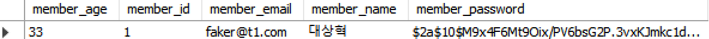

# PasswordEncoder

Spring Boot 기반 로그인 회원가입 기능에서 **비밀번호 암호화(BCrypt)** 를 적용한 예제 프로젝트입니다.

## 🔐 주요 기능

- 회원가입 시 비밀번호 암호화 처리 (`BCryptPasswordEncoder`)
- 중복 이메일 / 이름 체크
- Thymeleaf를 이용한 폼 제출
- Spring Data JPA 기반 Member 저장

## 🛠 사용 기술

- Java 17
- Spring Boot 3.x
- Spring Security (비밀번호 암호화용만 사용)
- Thymeleaf
- H2 / MySQL (선택 가능)
- Gradle 또는 Maven

## ✨ 주요 코드 예시

```java
// 암호화 적용
String encodedPassword = passwordEncoder.encode(members.getPassword());
member.setPassword(encodedPassword);


## 암호화 적용 예시

회원가입 시 비밀번호가 아래처럼 암호화되어 저장됩니다.


`

